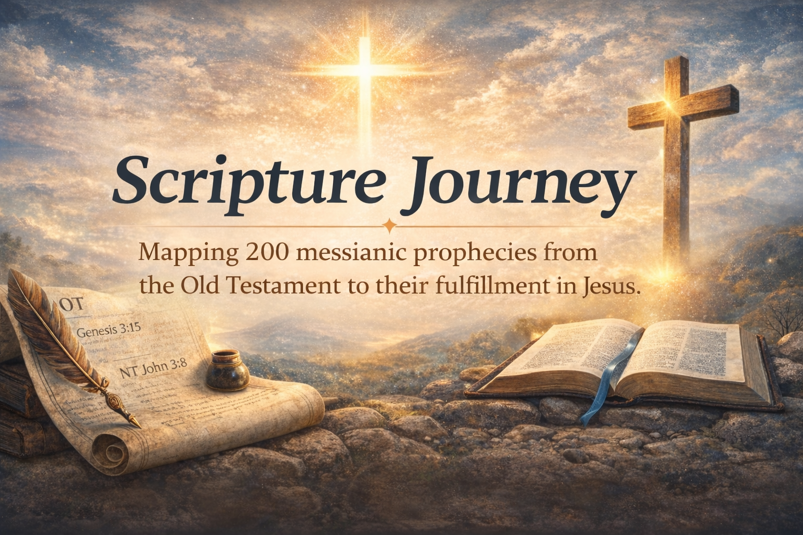
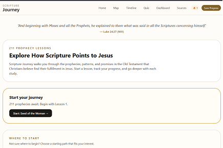
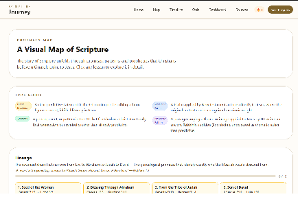
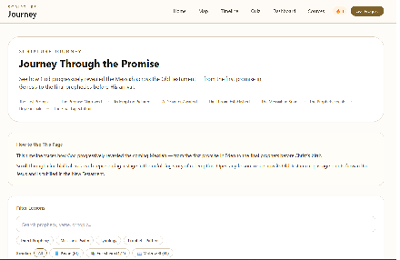
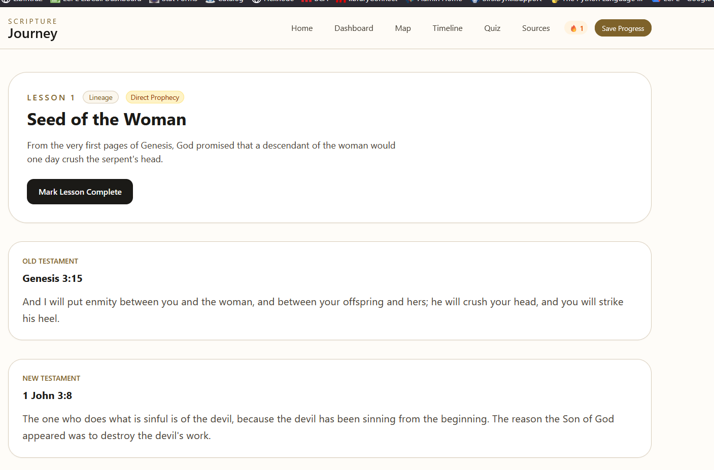
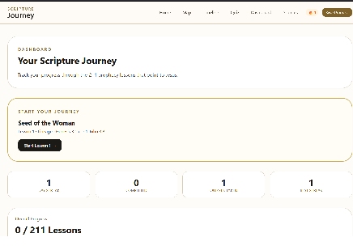
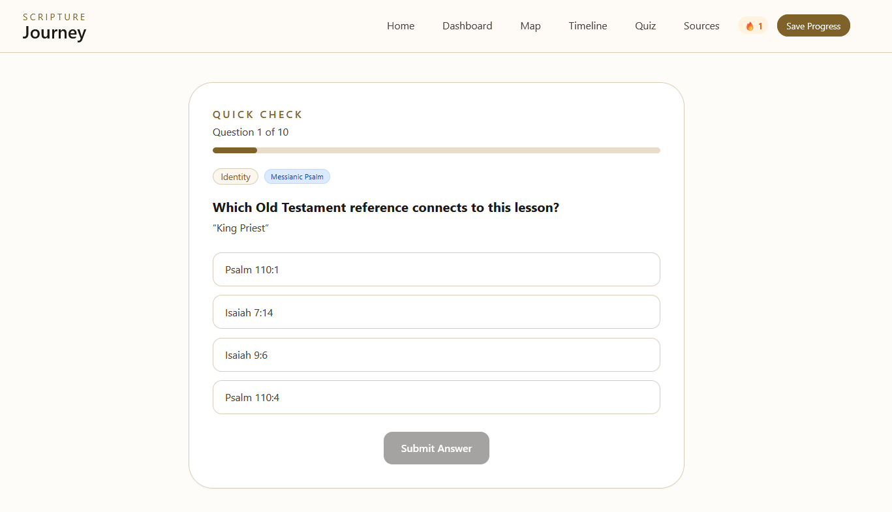

# Scripture Journey

<p align="center">
  
</p>

<p align="center">
  <a href="https://nextjs.org"></a>
  &nbsp;
  <a href="https://www.typescriptlang.org"></a>
  &nbsp;
  <a href="./LICENSE"></a>
  &nbsp;
  
</p>

<p align="center"><em>A Christ-centered learning app for exploring how the whole Bible points to Jesus.</em></p>

## Explore How the Bible Points to Jesus

> *"And beginning with Moses and all the Prophets, he explained to them what was said in all the Scriptures concerning himself."*
> — **Luke 24:27 (NIV)**

Scripture Journey is a Christ-centered web app that helps readers explore how the entire Bible points to Jesus through **211 messianic prophecy lessons**.

Each lesson connects:

- Old Testament prophecy
- New Testament fulfillment
- Scholarly attribution
- A reflective *"Why This Matters"* section

---

## Quick Links

<p align="center">
  🌐 <a href="https://www.scripturejourney.com/">Live Demo</a> &nbsp;|&nbsp;
  📚 <a href="https://www.scripturejourney.com/prophecies">Browse Lessons</a> &nbsp;|&nbsp;
  🗺️ <a href="https://www.scripturejourney.com/map">Prophecy Map</a> &nbsp;|&nbsp;
  ⏳ <a href="https://www.scripturejourney.com/timeline">Timeline</a> &nbsp;|&nbsp;
  🧠 <a href="https://www.scripturejourney.com/quiz">Quiz</a>
</p>

---

## Why Scripture Journey Exists

Many Bible tools help people read Scripture, but fewer help them trace how the entire biblical story points to Christ.

Scripture Journey was built to guide learners through a simple progression:

**Lesson → Category → Biblical Storyline → Christ**

Inspired by Luke 24:27, the app helps users explore the unfolding promise of the Messiah in a way that is reverent, approachable, and visually clear.

---

## Screenshots

<table align="center">
  <tr>
    <td align="center"><strong>Homepage</strong></td>
    <td align="center"><strong>Prophecy Map</strong></td>
  </tr>
  <tr>
    <td></td>
    <td></td>
  </tr>
  <tr>
    <td align="center"><strong>Timeline</strong></td>
    <td align="center"><strong>Lesson Page</strong></td>
  </tr>
  <tr>
    <td></td>
    <td></td>
  </tr>
  <tr>
    <td align="center"><strong>Dashboard</strong></td>
    <td align="center"><strong>Quiz</strong></td>
  </tr>
  <tr>
    <td></td>
    <td></td>
  </tr>
</table>

---

## Features

- **211 prophecy-centered lessons**, each including:
  - Old Testament prophecy + New Testament fulfillment
  - A unique *"Why This Matters"* reflection
  - Scholarly source badges
- **7 prophetic categories**: Lineage, Identity, Ministry, Rejection, Passion, Resurrection, Kingdom
- **4 prophecy types**: Direct Prophecy, Messianic Psalm, Typology, Prophetic Pattern
- Visual **Prophecy Map** and **Timeline**
- **Dashboard** with progress tracking and study streak
- **Adaptive quiz** drawn from completed lessons
- **Search and filtering** across all lessons
- **Surprise Me** random lesson feature
- **Sources page** with per-scholar lesson counts
- Local progress tracking via `localStorage`
- **PWA** install support
- Accessible, responsive UI

---

## Prophetic Categories

| Category | Description |
|---|---|
| **Lineage** | Ancestry and genealogy of the Messiah |
| **Identity** | Names, titles, and nature of the Messiah |
| **Ministry** | Teaching, miracles, and mission |
| **Rejection** | Opposition, betrayal, and denial |
| **Passion** | Suffering and crucifixion |
| **Resurrection** | Rising from the dead |
| **Kingdom** | Messiah's reign and eternal dominion |

---

## Example Lesson

| Field | Content |
|---|---|
| **Title** | Seed of the Woman |
| **Old Testament** | Genesis 3:15 |
| **New Testament** | 1 John 3:8 |
| **Theme** | The promised descendant who would defeat the serpent |
| **Category** | Lineage |
| **Type** | Direct Prophecy |

> *"Why This Matters"* — This is the first messianic promise in Scripture, sometimes called the *Protoevangelium* ("first gospel"). From the very moment of humanity's fall, God pointed toward a Redeemer.

---

## Scholarly Sources

Lessons are attributed to three widely recognized works on messianic prophecy:

### 📘 J. Barton Payne — *Encyclopedia of Biblical Prophecy* (1973)
Catalogs 191 messianic prophecies and provides the numbering system used for cross-reference. Referenced in **62 lessons**.

### 📚 Alfred Edersheim — *The Life and Times of Jesus the Messiah* (1883)
Appendix IX catalogs 456 Old Testament passages applied to the Messiah. Referenced in **176 lessons**.

### 📖 Josh McDowell — *The New Evidence That Demands a Verdict* (1999)
Provides detailed evidence for prophecy fulfillment. Referenced in **60 lessons**.

---

## Tech Stack

| Layer | Technology |
|---|---|
| Framework | Next.js 14 (App Router) |
| Language | TypeScript |
| Styling | Tailwind CSS |
| ORM | Prisma |
| Database | PostgreSQL |
| Hosting | Render |
| App Format | Progressive Web App |

---

## Local Development

```bash
# Install dependencies
npm install

# Start development server
npm run dev
```

Open [http://localhost:3000](http://localhost:3000)

```bash
# Build for production
npm run build
npm start
```

### Project Structure

```
app/         Next.js App Router pages
components/  Reusable UI components
data/        Lesson dataset
lib/         Utilities and types
public/      Static assets and PWA files
```

---

## Deployment

Configured for [Render](https://render.com) with a managed PostgreSQL database.

**Required environment variables:**

```env
DATABASE_URL=
NEXTAUTH_URL=
NEXTAUTH_SECRET=
EMAIL_FROM=
```

Database migrations run automatically on deploy:

```bash
prisma migrate deploy
```

---

## Scripture Attribution

Scripture quotations taken from *The Holy Bible, New International Version® NIV®*.  
Copyright © 1973, 1978, 1984, 2011 by Biblica, Inc. Used for educational and devotional purposes.

---

## Mission

Scripture Journey exists to help people explore Scripture thoughtfully and reverently — and to see how the entire biblical story points to Jesus.